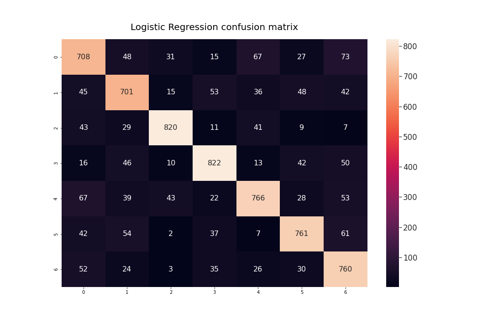
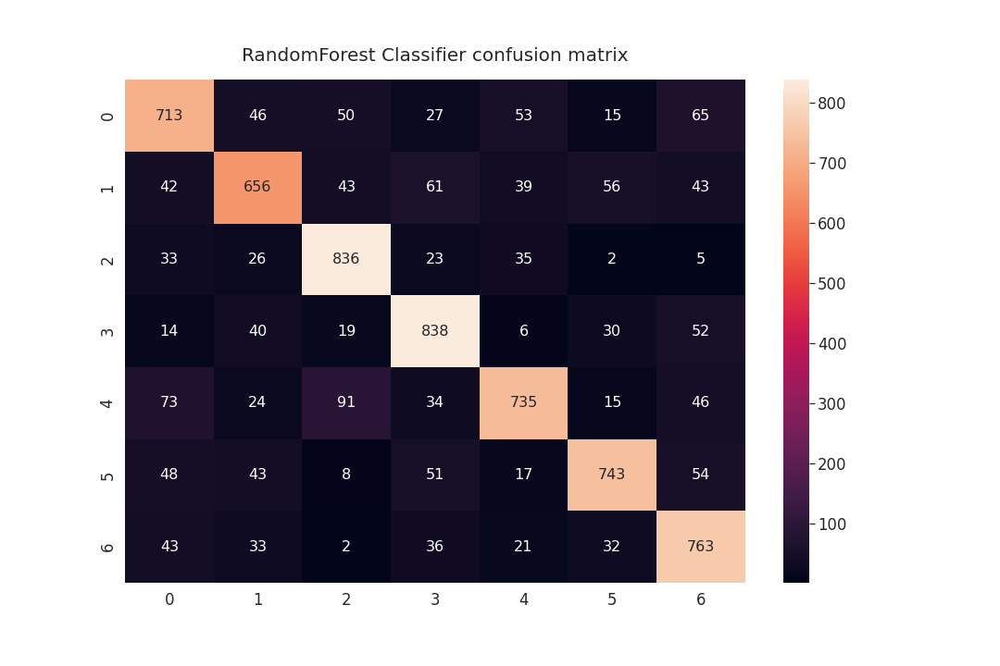
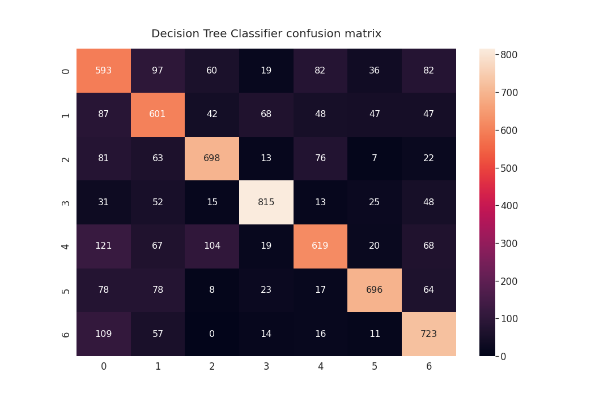
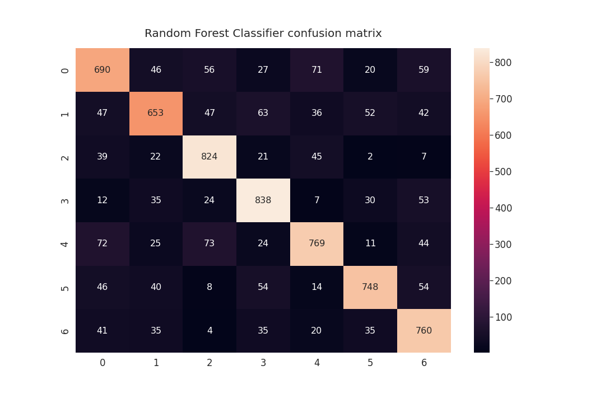
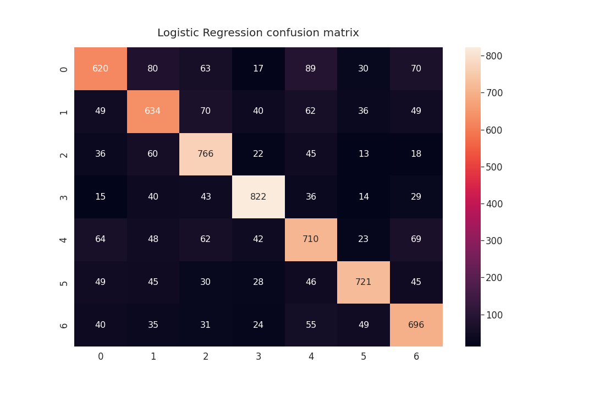
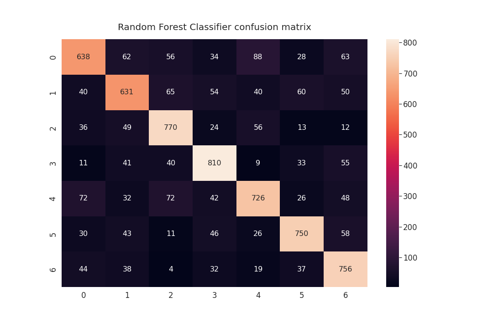
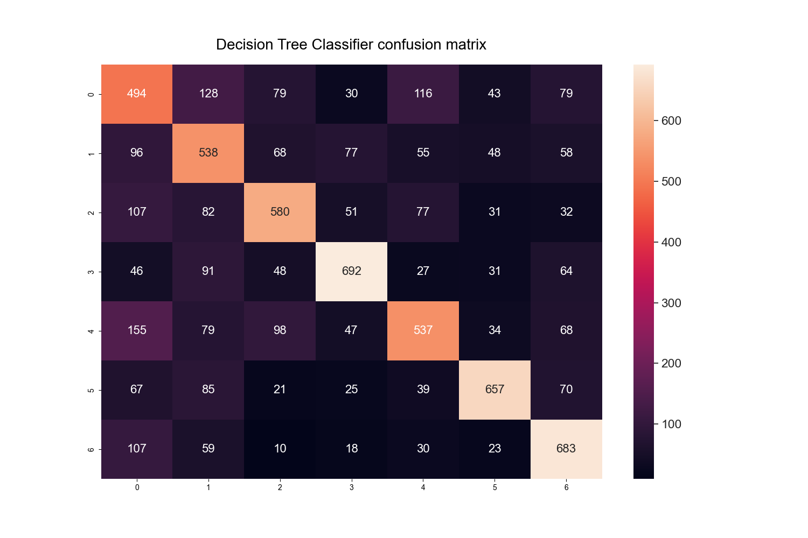

<h1><b>Project Name</b></h1>

<h2><b>Table of Contents</b></h2>
•	Introduction
•	Dataset
•	Used Libraries
•	Notebooks in use
•	Data Cleaning and Preprocessing
•	Model Building and Evaluation

<h2><b>Introduction</b></h2>
The project aims to use personal data to discover the best machine learning model that can identify the right article category
Dataset

<h2><b>Dataset structure:</b></h2>
<table class=MsoNormalTable border=0 cellspacing=0 cellpadding=0 width=624
 style='width:468.0pt;margin-left:-.15pt;border-collapse:collapse'>
 <tr style='height:15.75pt'>
  <td width=624 nowrap colspan=3 valign=bottom style='width:468.0pt;border:
  solid windowtext 1.0pt;padding:0cm 5.4pt 0cm 5.4pt;height:15.75pt'>
  
Dataset's „National defence
  articles and keywords“ structure

  </td>
 </tr>
 <tr style='height:15.0pt'>
  <td width=143 nowrap valign=bottom style='width:107.15pt;border:solid windowtext 1.0pt;
  border-top:none;padding:0cm 5.4pt 0cm 5.4pt;height:15.0pt'>
  
article_id

  </td>
  <td width=85 nowrap valign=bottom style='width:63.65pt;border-top:none;
  border-left:none;border-bottom:solid windowtext 1.0pt;border-right:solid windowtext 1.0pt;
  padding:0cm 5.4pt 0cm 5.4pt;height:15.0pt'>
  
int

  </td>
  <td width=396 nowrap valign=bottom style='width:297.2pt;border-top:none;
  border-left:none;border-bottom:solid windowtext 1.0pt;border-right:solid windowtext 1.0pt;
  padding:0cm 5.4pt 0cm 5.4pt;height:15.0pt'>
  
article id

  </td>
 </tr>
 <tr style='height:15.0pt'>
  <td width=143 nowrap valign=bottom style='width:107.15pt;border:solid windowtext 1.0pt;
  border-top:none;padding:0cm 5.4pt 0cm 5.4pt;height:15.0pt'>
  
keyword_id

  </td>
  <td width=85 nowrap valign=bottom style='width:63.65pt;border-top:none;
  border-left:none;border-bottom:solid windowtext 1.0pt;border-right:solid windowtext 1.0pt;
  padding:0cm 5.4pt 0cm 5.4pt;height:15.0pt'>
  
int

  </td>
  <td width=396 nowrap valign=bottom style='width:297.2pt;border-top:none;
  border-left:none;border-bottom:solid windowtext 1.0pt;border-right:solid windowtext 1.0pt;
  padding:0cm 5.4pt 0cm 5.4pt;height:15.0pt'>
  
keyword that belongs to the article id

  </td>
 </tr>
 <tr style='height:15.0pt'>
  <td width=143 nowrap valign=bottom style='width:107.15pt;border:solid windowtext 1.0pt;
  border-top:none;padding:0cm 5.4pt 0cm 5.4pt;height:15.0pt'>
  
keyword_name

  </td>
  <td width=85 nowrap valign=bottom style='width:63.65pt;border-top:none;
  border-left:none;border-bottom:solid windowtext 1.0pt;border-right:solid windowtext 1.0pt;
  padding:0cm 5.4pt 0cm 5.4pt;height:15.0pt'>
  
string

  </td>
  <td width=396 nowrap valign=bottom style='width:297.2pt;border-top:none;
  border-left:none;border-bottom:solid windowtext 1.0pt;border-right:solid windowtext 1.0pt;
  padding:0cm 5.4pt 0cm 5.4pt;height:15.0pt'>
  
keyword's what belongs to the article name

  </td>
 </tr>
 <tr style='height:15.0pt'>
  <td width=143 nowrap valign=bottom style='width:107.15pt;border:solid windowtext 1.0pt;
  border-top:none;padding:0cm 5.4pt 0cm 5.4pt;height:15.0pt'>
  
article_title

  </td>
  <td width=85 nowrap valign=bottom style='width:63.65pt;border-top:none;
  border-left:none;border-bottom:solid windowtext 1.0pt;border-right:solid windowtext 1.0pt;
  padding:0cm 5.4pt 0cm 5.4pt;height:15.0pt'>
  
string

  </td>
  <td width=396 nowrap valign=bottom style='width:297.2pt;border-top:none;
  border-left:none;border-bottom:solid windowtext 1.0pt;border-right:solid windowtext 1.0pt;
  padding:0cm 5.4pt 0cm 5.4pt;height:15.0pt'>
  
article title

  </td>
 </tr>
 <tr style='height:15.0pt'>
  <td width=143 nowrap valign=bottom style='width:107.15pt;border:solid windowtext 1.0pt;
  border-top:none;padding:0cm 5.4pt 0cm 5.4pt;height:15.0pt'>
  
article_body

  </td>
  <td width=85 nowrap valign=bottom style='width:63.65pt;border-top:none;
  border-left:none;border-bottom:solid windowtext 1.0pt;border-right:solid windowtext 1.0pt;
  padding:0cm 5.4pt 0cm 5.4pt;height:15.0pt'>
  
string

  </td>
  <td width=396 nowrap valign=bottom style='width:297.2pt;border-top:none;
  border-left:none;border-bottom:solid windowtext 1.0pt;border-right:solid windowtext 1.0pt;
  padding:0cm 5.4pt 0cm 5.4pt;height:15.0pt'>
  
article text

  </td>
 </tr>
 <tr style='height:15.0pt'>
  <td width=143 nowrap valign=bottom style='width:107.15pt;border:solid windowtext 1.0pt;
  border-top:none;padding:0cm 5.4pt 0cm 5.4pt;height:15.0pt'>
  
pubdatetime

  </td>
  <td width=85 nowrap valign=bottom style='width:63.65pt;border-top:none;
  border-left:none;border-bottom:solid windowtext 1.0pt;border-right:solid windowtext 1.0pt;
  padding:0cm 5.4pt 0cm 5.4pt;height:15.0pt'>
  
datetime

  </td>
  <td width=396 nowrap valign=bottom style='width:297.2pt;border-top:none;
  border-left:none;border-bottom:solid windowtext 1.0pt;border-right:solid windowtext 1.0pt;
  padding:0cm 5.4pt 0cm 5.4pt;height:15.0pt'>
  
article publish date and time

  </td>
 </tr>
</table>
keyword_id and keyword_name has 7 unique values and these following amounts of articles in a sample data.:
<table class=MsoTableGrid border=1 cellspacing=0 cellpadding=0
 style='border-collapse:collapse;border:none'>
 <tr>
  <td width=500 valign=top style='width:375.25pt;border:solid windowtext 1.0pt;
  padding:0cm 5.4pt 0cm 5.4pt'>
  
Kariuomenės stiprinimas,
  pratybos                                     

  </td>
  <td width=123 valign=top style='width:92.25pt;border:solid windowtext 1.0pt;
  border-left:none;padding:0cm 5.4pt 0cm 5.4pt'>
  
10

  </td>
 </tr>
 <tr>
  <td width=500 valign=top style='width:375.25pt;border:solid windowtext 1.0pt;
  border-top:none;padding:0cm 5.4pt 0cm 5.4pt'>
  
Įsigijimai ir biudžetas                                              
  

  </td>
  <td width=123 valign=top style='width:92.25pt;border-top:none;border-left:
  none;border-bottom:solid windowtext 1.0pt;border-right:solid windowtext 1.0pt;
  padding:0cm 5.4pt 0cm 5.4pt'>
  
10

  </td>
 </tr>
 <tr>
  <td width=500 valign=top style='width:375.25pt;border:solid windowtext 1.0pt;
  border-top:none;padding:0cm 5.4pt 0cm 5.4pt'>
  
Saugumo ir gynybos
  politika                                           

  </td>
  <td width=123 valign=top style='width:92.25pt;border-top:none;border-left:
  none;border-bottom:solid windowtext 1.0pt;border-right:solid windowtext 1.0pt;
  padding:0cm 5.4pt 0cm 5.4pt'>
  
10

  </td>
 </tr>
 <tr>
  <td width=500 valign=top style='width:375.25pt;border:solid windowtext 1.0pt;
  border-top:none;padding:0cm 5.4pt 0cm 5.4pt'>
  
Kibernetinis
  saugumas                                                 

  </td>
  <td width=123 valign=top style='width:92.25pt;border-top:none;border-left:
  none;border-bottom:solid windowtext 1.0pt;border-right:solid windowtext 1.0pt;
  padding:0cm 5.4pt 0cm 5.4pt'>
  
10

  </td>
 </tr>
 <tr>
  <td width=500 valign=top style='width:375.25pt;border:solid windowtext 1.0pt;
  border-top:none;padding:0cm 5.4pt 0cm 5.4pt'>
  
Pilietiškumas ir atsparumas propagandai                               

  </td>
  <td width=123 valign=top style='width:92.25pt;border-top:none;border-left:
  none;border-bottom:solid windowtext 1.0pt;border-right:solid windowtext 1.0pt;
  padding:0cm 5.4pt 0cm 5.4pt'>
  
10

  </td>
 </tr>
 <tr>
  <td width=500 valign=top style='width:375.25pt;border:solid windowtext 1.0pt;
  border-top:none;padding:0cm 5.4pt 0cm 5.4pt'>
  
Incidentai, nelaimės,
  kriminalai                                      

  </td>
  <td width=123 valign=top style='width:92.25pt;border-top:none;border-left:
  none;border-bottom:solid windowtext 1.0pt;border-right:solid windowtext 1.0pt;
  padding:0cm 5.4pt 0cm 5.4pt'>
  
10

  </td>
 </tr>
 <tr>
  <td width=500 valign=top style='width:375.25pt;border:solid windowtext 1.0pt;
  border-top:none;padding:0cm 5.4pt 0cm 5.4pt'>
  
Kariuomenės pagalba kitoms valstybės institucijoms ir
  gyventojams     

  
&nbsp;

  </td>
  <td width=123 valign=top style='width:92.25pt;border-top:none;border-left:
  none;border-bottom:solid windowtext 1.0pt;border-right:solid windowtext 1.0pt;
  padding:0cm 5.4pt 0cm 5.4pt'>
  
10

  </td>
 </tr>
</table>

File example: data/Kam_tema_sample_1
I used bigger dataset uploaded to google drive:
https://drive.google.com/drive/folders/11-4ZQv4eUTusCNIscl1SEy6ui_FyXs8T?usp=sharing
<table class=MsoTableGrid border=1 cellspacing=0 cellpadding=0
 style='border-collapse:collapse;border:none'>
 <tr>
  <td width=491 valign=top style='width:368.15pt;border:solid windowtext 1.0pt;
  padding:0cm 5.4pt 0cm 5.4pt'>
  
Kariuomenės stiprinimas,
  pratybos                                     

  </td>
  <td width=132 valign=top style='width:99.35pt;border:solid windowtext 1.0pt;
  border-left:none;padding:0cm 5.4pt 0cm 5.4pt'>
  
3000

  </td>
 </tr>
 <tr>
  <td width=491 valign=top style='width:368.15pt;border:solid windowtext 1.0pt;
  border-top:none;padding:0cm 5.4pt 0cm 5.4pt'>
  
Įsigijimai ir biudžetas                                              
  

  </td>
  <td width=132 valign=top style='width:99.35pt;border-top:none;border-left:
  none;border-bottom:solid windowtext 1.0pt;border-right:solid windowtext 1.0pt;
  padding:0cm 5.4pt 0cm 5.4pt'>
  
3000

  </td>
 </tr>
 <tr>
  <td width=491 valign=top style='width:368.15pt;border:solid windowtext 1.0pt;
  border-top:none;padding:0cm 5.4pt 0cm 5.4pt'>
  
Saugumo ir gynybos
  politika                                           

  </td>
  <td width=132 valign=top style='width:99.35pt;border-top:none;border-left:
  none;border-bottom:solid windowtext 1.0pt;border-right:solid windowtext 1.0pt;
  padding:0cm 5.4pt 0cm 5.4pt'>
  
3000

  </td>
 </tr>
 <tr>
  <td width=491 valign=top style='width:368.15pt;border:solid windowtext 1.0pt;
  border-top:none;padding:0cm 5.4pt 0cm 5.4pt'>
  
Kibernetinis
  saugumas                                                 

  </td>
  <td width=132 valign=top style='width:99.35pt;border-top:none;border-left:
  none;border-bottom:solid windowtext 1.0pt;border-right:solid windowtext 1.0pt;
  padding:0cm 5.4pt 0cm 5.4pt'>
  
3000

  </td>
 </tr>
 <tr>
  <td width=491 valign=top style='width:368.15pt;border:solid windowtext 1.0pt;
  border-top:none;padding:0cm 5.4pt 0cm 5.4pt'>
  
Pilietiškumas ir atsparumas propagandai                               

  </td>
  <td width=132 valign=top style='width:99.35pt;border-top:none;border-left:
  none;border-bottom:solid windowtext 1.0pt;border-right:solid windowtext 1.0pt;
  padding:0cm 5.4pt 0cm 5.4pt'>
  
3000

  </td>
 </tr>
 <tr>
  <td width=491 valign=top style='width:368.15pt;border:solid windowtext 1.0pt;
  border-top:none;padding:0cm 5.4pt 0cm 5.4pt'>
  
Incidentai, nelaimės,
  kriminalai                                      

  </td>
  <td width=132 valign=top style='width:99.35pt;border-top:none;border-left:
  none;border-bottom:solid windowtext 1.0pt;border-right:solid windowtext 1.0pt;
  padding:0cm 5.4pt 0cm 5.4pt'>
  
3000

  </td>
 </tr>
 <tr style='height:18.45pt'>
  <td width=491 valign=top style='width:368.15pt;border:solid windowtext 1.0pt;
  border-top:none;padding:0cm 5.4pt 0cm 5.4pt;height:18.45pt'>
  
Kariuomenės pagalba kitoms valstybės institucijoms ir
  gyventojams     

  
&nbsp;

  </td>
  <td width=132 valign=top style='width:99.35pt;border-top:none;border-left:
  none;border-bottom:solid windowtext 1.0pt;border-right:solid windowtext 1.0pt;
  padding:0cm 5.4pt 0cm 5.4pt;height:18.45pt'>
  
1413

  </td>
 </tr>
</table>
File example: data/Kam_tema_3000_1

Later I will use these my categories for train target.

In the share drive there is also data that can be used for small predictions:

<table class=MsoTableGrid border=1 cellspacing=0 cellpadding=0
 style='border-collapse:collapse;border:none'>
 <tr>
  <td width=491 valign=top style='width:368.15pt;border:solid windowtext 1.0pt;
  padding:0cm 5.4pt 0cm 5.4pt'>
  
Kariuomenės stiprinimas,
  pratybos                                     

  </td>
  <td width=132 valign=top style='width:99.35pt;border:solid windowtext 1.0pt;
  border-left:none;padding:0cm 5.4pt 0cm 5.4pt'>
  
5

  </td>
 </tr>
 <tr>
  <td width=491 valign=top style='width:368.15pt;border:solid windowtext 1.0pt;
  border-top:none;padding:0cm 5.4pt 0cm 5.4pt'>
  
Įsigijimai ir
  biudžetas                                               

  </td>
  <td width=132 valign=top style='width:99.35pt;border-top:none;border-left:
  none;border-bottom:solid windowtext 1.0pt;border-right:solid windowtext 1.0pt;
  padding:0cm 5.4pt 0cm 5.4pt'>
  
5

  </td>
 </tr>
 <tr>
  <td width=491 valign=top style='width:368.15pt;border:solid windowtext 1.0pt;
  border-top:none;padding:0cm 5.4pt 0cm 5.4pt'>
  
Saugumo ir gynybos
  politika                                           

  </td>
  <td width=132 valign=top style='width:99.35pt;border-top:none;border-left:
  none;border-bottom:solid windowtext 1.0pt;border-right:solid windowtext 1.0pt;
  padding:0cm 5.4pt 0cm 5.4pt'>
  
5

  </td>
 </tr>
 <tr>
  <td width=491 valign=top style='width:368.15pt;border:solid windowtext 1.0pt;
  border-top:none;padding:0cm 5.4pt 0cm 5.4pt'>
  
Kibernetinis
  saugumas                                                 

  </td>
  <td width=132 valign=top style='width:99.35pt;border-top:none;border-left:
  none;border-bottom:solid windowtext 1.0pt;border-right:solid windowtext 1.0pt;
  padding:0cm 5.4pt 0cm 5.4pt'>
  
5

  </td>
 </tr>
 <tr>
  <td width=491 valign=top style='width:368.15pt;border:solid windowtext 1.0pt;
  border-top:none;padding:0cm 5.4pt 0cm 5.4pt'>
  
Pilietiškumas ir atsparumas
  propagandai                               

  </td>
  <td width=132 valign=top style='width:99.35pt;border-top:none;border-left:
  none;border-bottom:solid windowtext 1.0pt;border-right:solid windowtext 1.0pt;
  padding:0cm 5.4pt 0cm 5.4pt'>
  
5

  </td>
 </tr>
 <tr>
  <td width=491 valign=top style='width:368.15pt;border:solid windowtext 1.0pt;
  border-top:none;padding:0cm 5.4pt 0cm 5.4pt'>
  
Incidentai, nelaimės, kriminalai                                     
  

  </td>
  <td width=132 valign=top style='width:99.35pt;border-top:none;border-left:
  none;border-bottom:solid windowtext 1.0pt;border-right:solid windowtext 1.0pt;
  padding:0cm 5.4pt 0cm 5.4pt'>
  
5

  </td>
 </tr>
 <tr style='height:18.45pt'>
  <td width=491 valign=top style='width:368.15pt;border:solid windowtext 1.0pt;
  border-top:none;padding:0cm 5.4pt 0cm 5.4pt;height:18.45pt'>
  
Kariuomenės pagalba kitoms valstybės institucijoms ir
  gyventojams     

  
&nbsp;

  </td>
  <td width=132 valign=top style='width:99.35pt;border-top:none;border-left:
  none;border-bottom:solid windowtext 1.0pt;border-right:solid windowtext 1.0pt;
  padding:0cm 5.4pt 0cm 5.4pt;height:18.45pt'>
  
5

  </td>
 </tr>
</table>
File example: data/Kam_predict_sample_1

<h2></b>Used Libraries<b></h2>

matplotlib
seaborn
googletrans
langdetect
sklearn
pandas
numpy
wordcloud
nltk
spaCy
bs4

<h2></b>Notebooks in use<b></h2>
Data_Science_final_projecy_(spaCy) .ipynb – using spaCy vectorizer for later predictions
Data_Science_final_project (cv and tf-idf).ipynb – using spaCy for lemmatizing and later CountVectorizer and TfidfVectorizer for vectorization and predictions

<h2></b>Data Cleaning and Preprocessing<b></h2>
For data cleaning using these functions: 
lower(text)
BeautifulSoup.remove_html_tags(text)
special_char(text)
slice(stop=10000)
langdetect.detect_lang(text)
googletrans.translate_text(text, dest_lang)
remove_stopwords(text)

<h2></b>Model Building and Evaluation<b></h2>

Used 3 vectorizers and 1 lemmatizer:
spaCy lemmatizer -> CountVectorizer
spaCy lemmatizer -> TfidfVectorizer
spaCy vectorizer
Built 3 simple models (Logistic Regression, Random Forest Classifier, Decision Tree Classifier) for each vectorizer

The results each reaced:
<b>CountVectorizer-> Logistic Regression</b>

 
<b>CountVectorizer-> Random Forest Classifier</b>
 
 
<b>CountVectorizer-> Decision Tree Classifier</b>
  
 

<b>TfidfVectorizer -> Logistic Regression</b>
  
 
<b>TfidfVectorizer -> Random Forest Classifier</b>
  
 
<b>TfidfVectorizer -> Decision Tree Classifier</b>
  
 
 

<b>spaCy vectorizer-> Logistic Regression</b>
    
<b>spaCy vectorizer-> Random Forest Classifier</b>
  
<b>spaCy vectorizer-> Decision Tree Classifier</b>
  
.

